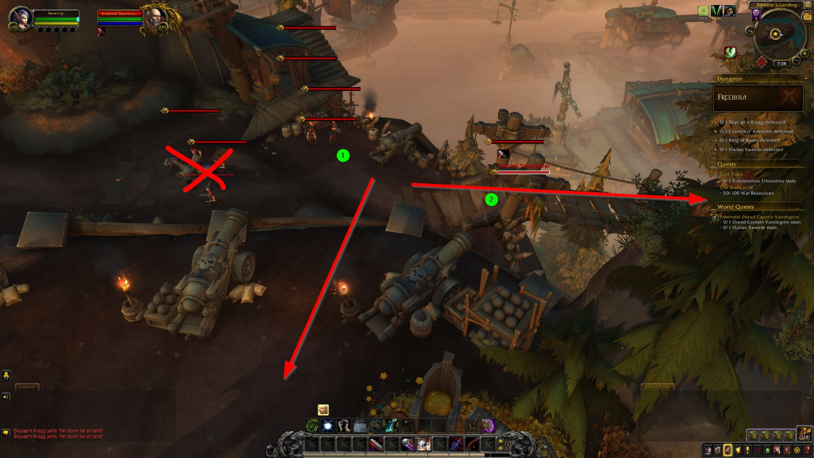

# Freehold (Teeming, Awakened)

### Pull #1

We'll pull all three packs here, lust, and cleave them down. The first obelisk will be down the hill to the right, near the arrow.

**Priority Targets:** Irontide Mastiff (dogs), Irontide Bonesaw, Irontide Enforcer

**Interrupts:** Healing Balm (Irontide Bonesaw)

**Avoidable Damage:** Brutal Backhand (Frontal, Irontide Enforcer)

### Pull #2

We'll be in the shadow realm, and we'll drag the big mob all the way across this plateau back into the circular area for the first boss.

**Avoidable Damage:** Dark Fury (13y radius from mob)

### Pull #3

Similar pack as the first pull. Don't stack on tank b/c of quaking and the slime from the parrot, but try not to be farther than you have to be.

**Priority Targets:** Irontide Mastiff (dogs), Irontide Bonesaw, Irontide Enforcer

**Interrupts:** Healing Balm (Irontide Bonesaw)

**Avoidable Damage:** Brutal Backhand (Frontal, Irontide Enforcer)

### Pull #4

We'll pull the Enforcer (1) and the Corsair pack (2) and fight them on the bridge. The packs at 3 and 4 leave after the first boss is killed, I'm pretty sure.

**Priority Targets:** Irontide Enforcer

**Avoidable Damage:** Brutal Backhand (Frontal, Irontide Enforcer)

### Pull #5

We'll pull the pack on the right first (1), which is a Duelist and Oarsman plus a handfull of yellow guys in and around the building (5 of them). We want to pull these back onto the bridge to avoid the patrol (3), and the pack on the left.

**Priority Targets:** Cutwater Duelist, Irontide Oarsman

**Interrupts:** Sea Spout (Irontide Oarsman)

**Avoidable Damage:** Duelist Dash (Cutwater Duelist, straight-line charge to brown swirl, don't be between him and swirl)

### Pull #6

Next, depending on the position of the patrol, we'll either pull the patrol or the Knuckledusters (probably the Knuckledusters), we'll pull them back to a safe spot behind the building and burn them down.

**Priority Targets**: Blacktooth Knuckleduster, Blacktooth Scrapper

**Interrupts**: Shattering Bellow (Blacktooth Knuckleduster)

**Stuns**: Blind Rage (Blacktooth Scrapper)

### Pull #7

Finally, the patrol. The middle of the courtyard should be pretty clear now.

**Priority Targets:** Vermin Trapper

**Avoidable Damage:** Rat Traps (thrown by Trapper to all player positions, move once thrown to avoid the damage when they arm)

### Pull #8

The second obelisk will be in the middle of the courtyard. We'll enter and drag the miniboss down the hill, killing him at the bottom of the hill.

### Pull #9

After we come out of the obelisk, well pull these three packs (staggered). With any luck, we'll be able to pull the rat pack (3) last so we have plenty of room to deal with the traps.

**Priority Targets:** Bilge Rat Buccaneer, Bilge Rat Brinescale, Vermin Trapper

**Interrupts:** Frost Blast, Water Bolt (Bilge Rat Brinescale)

**Stuns:** Goin' Bananas (Bilge Rat Buccaneer)

**Avoidable Damage**: Rat Traps (Vermin Trapper, see above), Ricocheting Throw (Cutwater Knife Juggler, stay spread)

### Pull #10

Before we pull the boss, we'll kill the yellow guys, and the two nearby packs.  We may have to wait for the patrol on the left to come down the ramp. We'll need to pull them back near where we left the portal to avoid pulling the boss.

**Priority Targets:** Bilge Rat Buccaneer, Bilge Rat Brinescale

**Interrupts:** Frost Blast, Water Bolt (Bilge Rat Brinescale)

**Stuns:** Goin' Bananas (Bilge Rat Buccaneer)

**Avoidable Damage**: Ricocheting Throw (Cutwater Knife Juggler, stay spread from target)

### Pull #11

After killing the second boss (Eudora, then Jolly), we'll pull some more buccaneers and knife jugglers behind the building

**Priority Targets:** Bilge Rat Buccaneer, Bilge Rat Brinescale

**Interrupts:** Frost Blast, Water Bolt (Bilge Rat Brinescale)

**Stuns:** Goin' Bananas (Bilge Rat Buccaneer)

**Avoidable Damage**: Ricocheting Throw (Cutwater Knife Juggler, stay spread from target)

### Pull #12

Another pack of buccs and brinescales. The X'd out pack will already be dead. We want to avoid pulling the big crusher guy in the back until this pack is dead too.

**Priority Targets:** Bilge Rat Buccaneer, Bilge Rat Brinescale

**Interrupts:** Frost Blast, Water Bolt (Bilge Rat Brinescale)

**Stuns:** Goin' Bananas (Bilge Rat Buccaneer)

**Avoidable Damage**: Ricocheting Throw (Cutwater Knife Juggler, stay spread from target)

### Pull #13

We'll pull the crusher down into the arena and start the RP. (After we kill
the boss, the next obelisk will be somewhere near 2.)

**Priority Targets:** Irontide Crusher

**Avoidable Damage:** Ground Shatter (9y AoE centered on mob), Boulder Throw (swirl under a player, move to dodge)

### Pull #14

In between the pig and the turtle, and the turtle and the shark guy we'll pull the packs on the hill (1, 2, 3) down into the arena and kill them during RP. We want to avoid pulling the crusher.

**Priority Targets:** Bilge Rat Buccaneer, Bilge Rat Brinescale

**Interrupts:** Frost Blast, Water Bolt (Bilge Rat Brinescale)

**Stuns:** Goin' Bananas (Bilge Rat Buccaneer)

**Avoidable Damage**: Ricocheting Throw (Cutwater Knife Juggler, stay spread from target)

### Pull #15

We'll enter the obelisk and kite our way across the bridge and up into the corner of the final boss area. This mini-boss is the ooze that leaves shit all over the ground. It probably wouldn't hurt to start by kiting him around the arena while we wear him down. We just want to make sure we kill him up near the boss.

Once we're out of the void realm, we'll fight the last boss. He's going to summon the miniboss from the obelisk we didn't do. Focus the obelisk mob down first. It's **very** important that we don't let the obelisk mob cast Lingering Doubt, as it reduces casting speed by 70%.

**Priority Targets:** Voidweaver Mal'thir

**Interrupts:** Lingering Doubt (Voidweaver Mal'thir)

### Pull #16

Finally, we'll pull the last bit of trash that we need to finish the dungeon.  We'll want to pull them either up the hill, or down the bridge to avoid the patrol (probably bridge)

**Priority Targets:** Irontide Buccaneer, Irontide Stormcaller, Irontide Oarsman

**Interrupts:** Sea Spout (Irontide Oarsman), Thundering Squall (Irontide Stormcaller), **DO NOT INTERRUPT** Painful Motivation (Irontide Ravager)

**Stuns:** Blade Barrage (Irontide Buccaneer)
